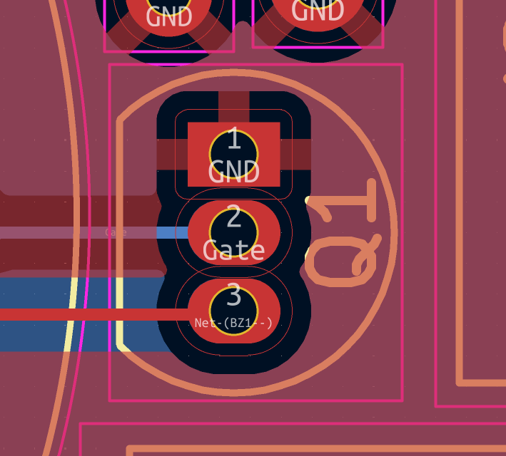
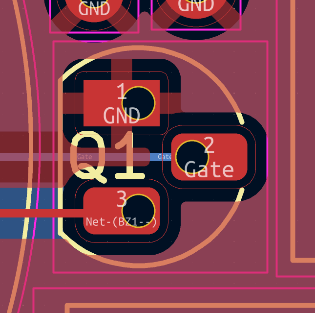
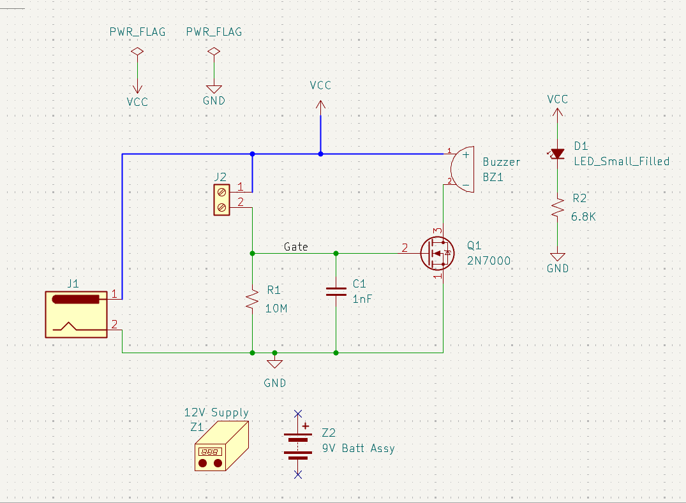
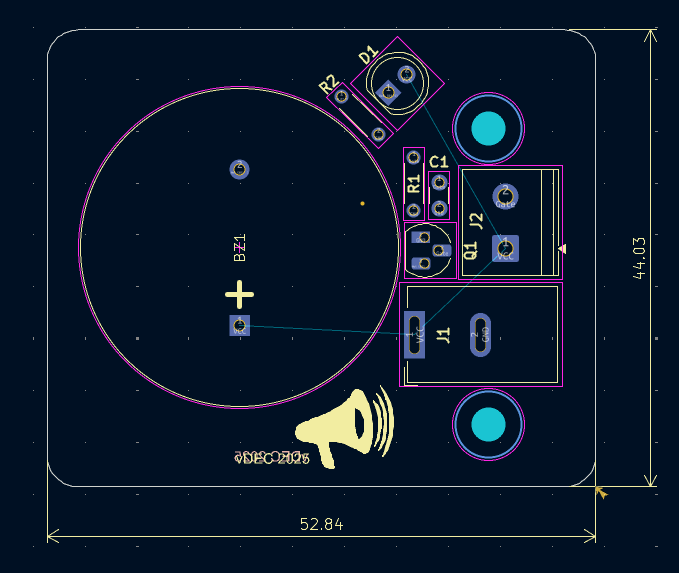
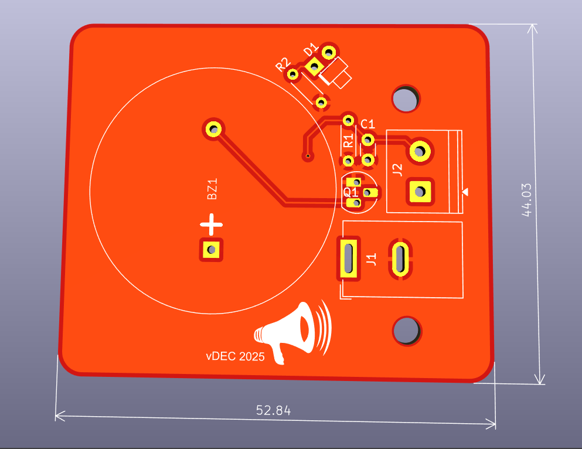
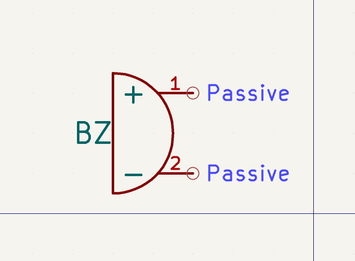
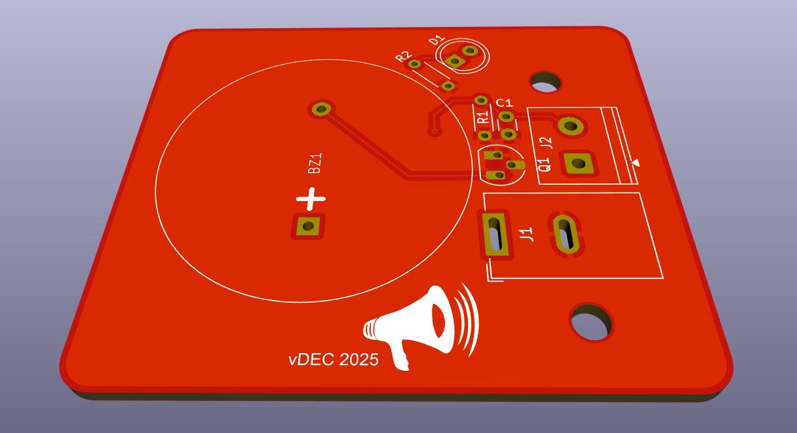
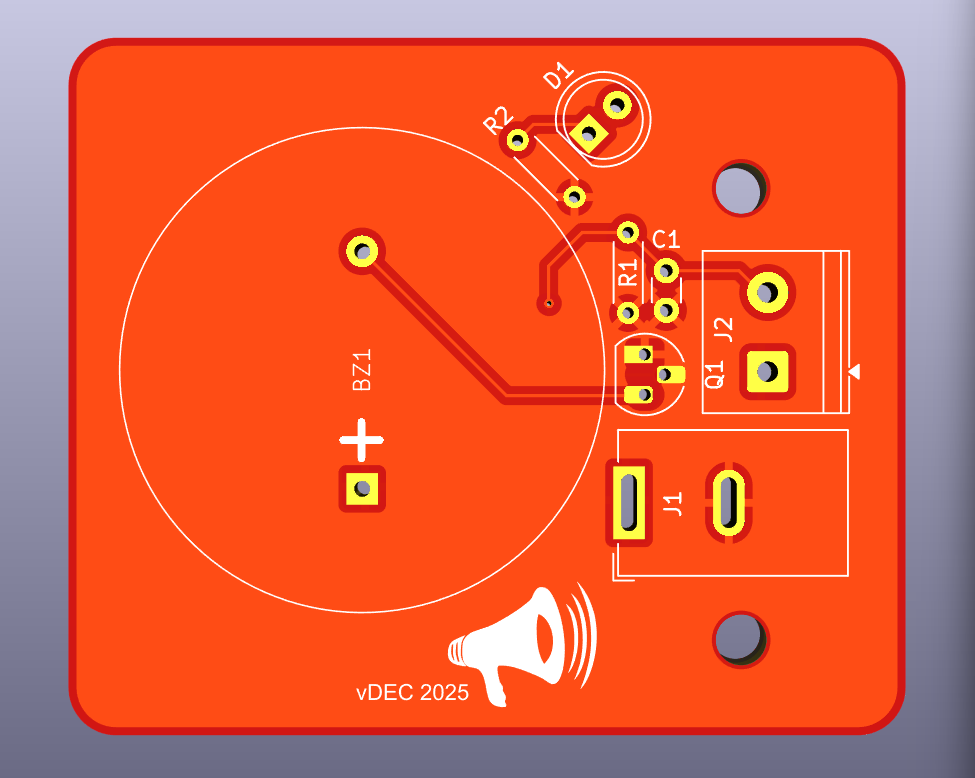
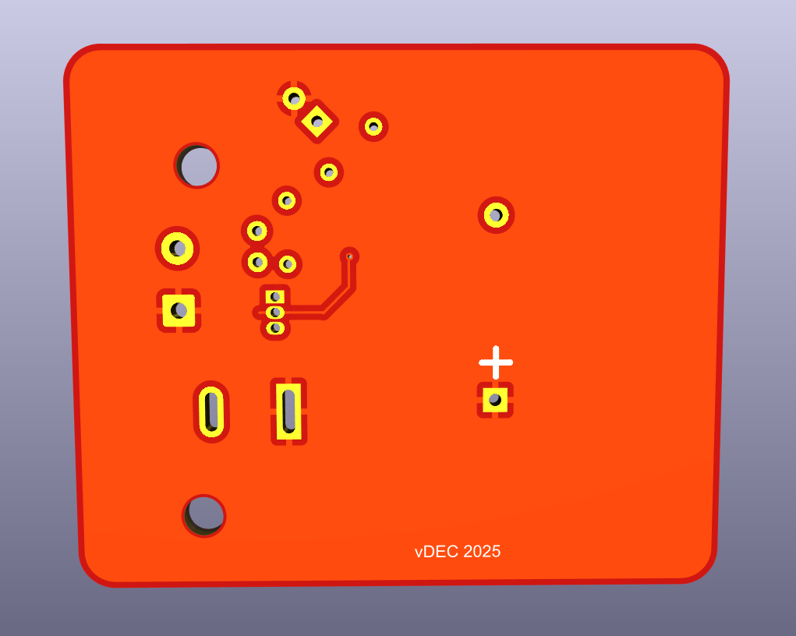

# Water-Alarm

## Overview
This project marks the start of my journey into practical PCB design. I began learning KiCAD by following tutorial videos from DigiKey on YouTube, applying the concepts to design a simple water alarm PCB.

 
3D View of Board with components
 

##

### What the Circuit Does
My first hands-on attempt at designing a printed circuit board.
- Designed as a basic water detection alarm.
- When water bridges the positive voltage supply to the gate of a MOSFET, it acts as a switch, powering a loud buzzer to alert you. This could help notify you of a potential flood, a leak under the sink, or a toilet overflow—anywhere water shouldn’t be.
- A simple, portable solution to detect unwanted water.
- The DigiKey tutorial videos I followed are linked at the bottom of this page.

### Why I Built This Project
The goal was to learn the fundamentals of PCB design and familiarise myself with the KiCAD environment through hands-on experience. It’s a simple application, but every journey starts somewhere, and this project gave me a solid foundation to build on.

## Circuit Design
### How the circuit works
Under normal conditions, the circuit remains open and no current flows through the screw terminal. When water bridges the terminals, the circuit is completed, allowing a voltage to be applied to the gate of the MOSFET. This switches the MOSFET on, enabling power from the DC barrel jack to drive the buzzer. The audible alert provides immediate indication of water presence, allowing early intervention and helping prevent escalation into more serious damage.

### Key Design Decisions
One important design decision involved changing the MOSFET footprint from **TO-92_Inline [left]** to **TO-92_HandSolder [right]**. The inline footprint places the pads very close together (approximately 50 mils / 1.27 mm), which increases the risk of solder bridging during hand soldering. The hand-solder footprint provides greater pad spacing, making the board easier and safer to assemble while reducing the likelihood of short circuits.

 

 
MOSFET Inline Footprint [left] & MOSFET HandSolder Footprint[right]
 
  

## Schematic

  

 
Schematic of Water Alarm Circuit
 
 
  
- External DC supply to connect via DC Barrel Jack (**J1**).
- Power Flags (**PWR_FLAGs**) used to indicate valid power sources to Electrical Rules Checker (ERC). 
- Voltage Supply (**VCC**) rail powers the buzzer, LED indicator, and MOSFET drain.

- Screw Terminal (**J2**) provides an external trigger input (e.g. water sensor electrodes).
- When water touches the contacts, conductivity will increase, leading to the gate voltage rising, activating the alarm.
- MOSFET Gate is driven by sensor input; drain controls current to buzzer.
- Buzzer activates when MOSFET conducts.

- Resistor 1 (**R1, 10MΩ**) acts as a pull-down resistor, keeping the MOSFET OFF when input (**J1**) is not connected to any supply (VCC) or ground.
- C1 (1nF) filters fast transients and reduces false triggering due to noise by absorbing any high-frequency signals.
- RC network improves the stability of the gate signal.

- LED provides visual indication of system power/alarm state.
- Design supports either external 12V supply or 9V battery source.
- However, only one power source should be connected at a time.

## PCB Layout
### Board size:

 
 

 
Dimensions: 52.84 x 44.03mm
 
  
##
### Buzzer Design:

 
Buzzer Design using Symbol Editor
 
  
##
### PCB Copper Layers:

 

 
Front Copper Layer & Back Copper Layer
 
  
##
### PCB Board Layouts:

 
PCB Board layout - Angle view
 
  
##

 

 
Top View & Bottom View
 
  
##

 

 
3D View: How the board will look with the components added
 
  
##

 

 
More 3D Views
 
  
##
